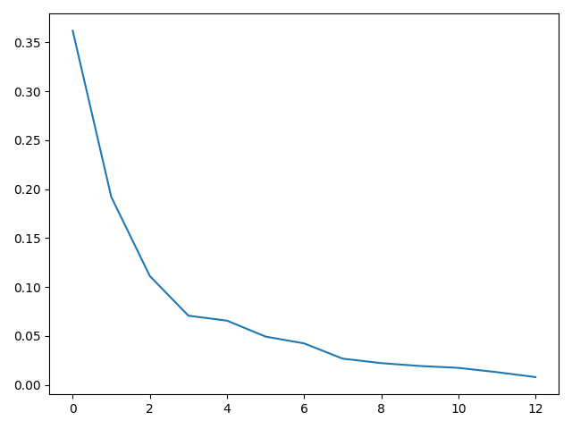
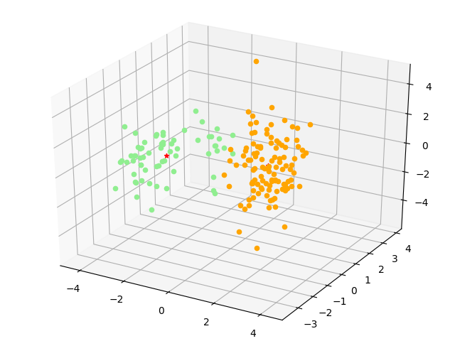
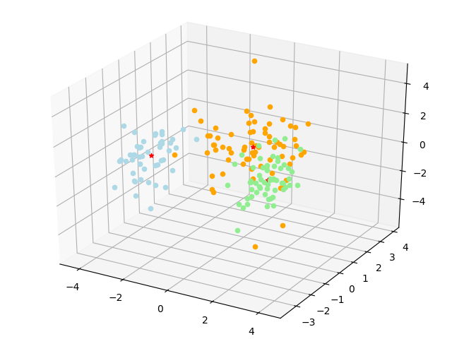
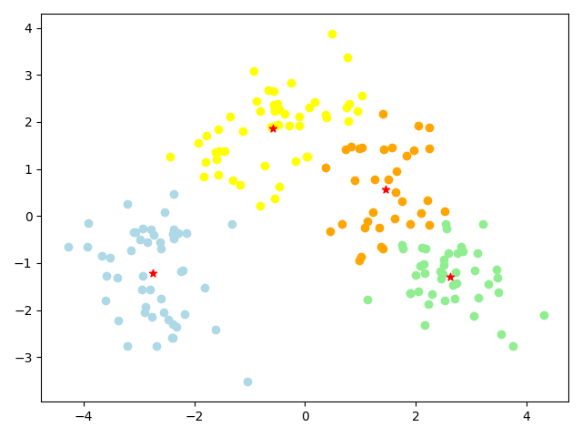
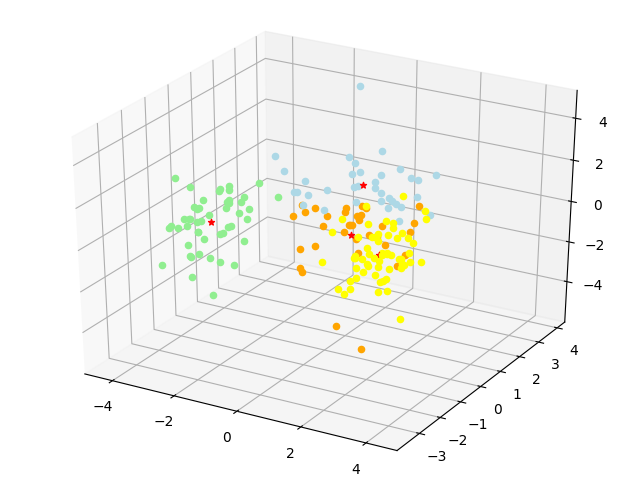

# 非监督学习

- PB17111568
- 郭雨轩

## 数据预处理

将除掉第一维的其余每列数据都做了`col = (col - mean(col)) / std(col)`的变换。

## PCA

### 算法思想

对输入的数据，我们希望对其进行线性变换，使得类间散度最大化，我们先构造协方差矩阵，之后逐个选取能使投影后方差最大的方向，直到维度满足我们的要求，这个过程也就是从大到小逐个选取协方差矩阵的特征值对应的特征向量，具体实现如下。

### 代码实现

训练代码：

```python
def fit(self, train_x):
    self.train_x = np.mat(train_x.copy()).T  # m * n m个样本，列向量
		
    # 计算均值
    mean_vec = np.mean(self.train_x, axis=1)
    # 计算误差矩阵
    var_mat = self.train_x - np.tile(mean_vec, self.train_x.shape[1])
    # 计算协方差矩阵
    cov_mat = var_mat * var_mat.T
    # 计算协方差矩阵的特征向量和特征值
    e_val, e_vec = np.linalg.eig(cov_mat)
    # 按照特征值排序排序
    tmp = sorted(zip(e_val, e_vec.T), reverse=True)
    e_val, e_vec = zip(*tmp)
    # 若根据threshold选取特征向量
    if self.use_threshold:
        total = sum(e_val)
        tmp = 0
        W = []
        # 逐个选取特征向量，知道大于threshold
        for i in range(len(e_val)):
            tmp += e_val[i]
            W.append(list(np.squeeze(np.array(e_vec[i]))))
            if tmp / total >= self.threshold:
                break
    else:
      	# 否则选择前k大特征值对应的特征向量
        W = [list(np.squeeze(np.array(e_vec[i]))) for i in range(self.first_k)]
		
    # W为投影矩阵
    self.W = np.mat(np.array(W)).T
    print('DIM:', self.W.shape)
    self.mean_vec = mean_vec
    # 计算降维后训练集
    proj_train = self.train_x.T * self.W
    return proj_train
```


## KMeans

### 算法思路

初始化时随机选取k个中心点，每轮迭代时不断的将所有的点划分到新的中心点对应的类别处，同时更新中心点，不断迭代直到中心点收敛。

### 代码实现

```python
def fit(self, train_x):
    self.train_x = np.mat(train_x.copy())
    m, n = np.shape(self.train_x)
    center = []
    # 初始化，随机选取中心点
    for i in random.sample(range(m), self.K):
        center.append(list(np.squeeze(np.array(self.train_x[i, :]))))
    center = np.mat(center)
    error = 10000000
    label = None
    # 当中心点更新的幅度大于threshold
    while error > self.threshold:
      	# 记录旧的中心
        center_old = center.copy()
        label = []
        # 按照现有的中心点，对每个点进行分类，这个点到哪个中心点最近就属于哪一类
        for i in range(m):
            min_label = -1
            min_distance = 10000000
            for j in range(self.K):
                dis_i_j = distance(self.train_x[i], center[j])
                if dis_i_j < min_distance:
                    min_distance = dis_i_j
                    min_label = j
            label.append(min_label)
            
        label = np.array(label)
        # 重新计算center
        center = np.array([np.mean(self.train_x[label == i, :], axis=0) for i in range(self.K)])
        center = np.mat(np.squeeze(center))
        # 计算较于旧的center到变化
        error = np.sum(np.linalg.norm(center-center_old, ord=2, axis=1))
    return center, np.expand_dims(label, 1)
```

## 实验部分

### PCA中主成分的占比



### 类别数=2

#### 不同程度降维的Kmeans精度

| DIM  | 轮廓系数 | 兰德系数 |
| :--: | :------: | :------: |
|  2   |  0.4649  |  0.6876  |
|  3   |  0.4002  |  0.6876  |
|  4   |  0.3239  |  0.6876  |
|  5   |  0.3674  |  0.6876  |
|  6   |  0.3163  |  0.6876  |
|  7   |  0.2918  |  0.6912  |
|  8   |  0.2893  |  0.6800  |
|  9   |  0.2854  |  0.6876  |
|  10  |  0.2697  |  0.6912  |
|  11  |  0.2737  |  0.6876  |
|  12  |  0.2615  |  0.6932  |
|  13  |  0.2596  |  0.6932  |

#### 降维可视化

降维至二维时：


降维至3维时：



### 类别数=3

#### 不同程度降维的Kmeans精度

| DIM  |  轮廓系数  |  兰德系数  |
| :--: | :--------: | :--------: |
|  2   | **0.5601** | **0.9310** |
|  3   |   0.4537   |   0.9542   |
|  4   |   0.4050   |   0.9318   |
|  5   |   0.3674   |   0.9310   |
|  6   |   0.3472   |   0.9620   |
|  7   |   0.3267   |   0.9382   |
|  8   |   0.3149   |   0.9542   |
|  9   |   0.3068   |   0.9542   |
|  10  |   0.2996   |   0.9620   |
|  11  |   0.2919   |   0.9542   |
|  12  |   0.2880   |   0.9542   |
|  13  |   0.2806   |   0.9466   |

#### 降维可视化

（此图中展示的是label的类别情况而非聚类预测的结果，可以看到聚类的准确性较高）

降维至二维时：


降维至三维时：



### 类别数=4

#### 不同程度降维的Kmeans精度

| DIM  | 轮廓系数 | 兰德系数 |
| :--: | :------: | :------: |
|  2   |  0.4855  |  0.8573  |
|  3   |  0.4106  |  0.8861  |
|  4   |  0.3856  |  0.9074  |
|  5   |  0.3007  |  0.9197  |
|  6   |  0.2958  |  0.8906  |
|  7   |  0.2710  |  0.8892  |
|  8   |  0.2915  |  0.9016  |
|  9   |  0.3150  |  0.9577  |
|  10  |  0.3065  |  0.9494  |
|  11  |  0.2622  |  0.9134  |
|  12  |  0.2510  |  0.8921  |
|  13  |  0.2146  |  0.8831  |

#### 降维可视化

降维至二维时：



降维至三维时：



### 结果分析

- 比较降维维度和聚类个数后，应选择降维维度为2，聚类类数为3，此时轮廓系数最大
- PCA降维的维度对KMeans的精度基本无影响，这是因为数据的维度本身就很小，PCA基本没有降维的必要
- 可视化结果中，当降维到2维时，可以看到绝大部分的点都可以被正确聚类，但是有部分的离群点不能被正确的分类，可以考虑对数据集更细致的统计分析，改进规范化的方法，提升精度